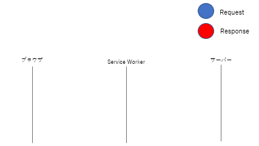
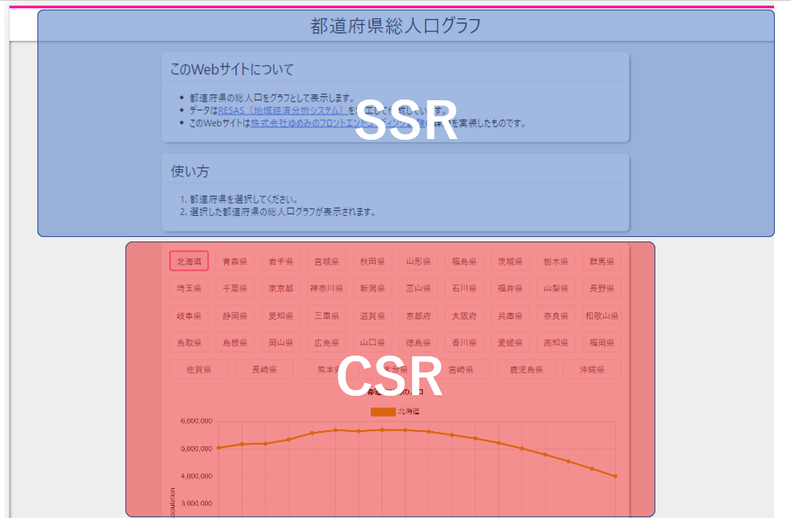

# population-graph

[](https://github.com/ayame113/population-graph/actions/workflows/ci.yml)
[](https://codecov.io/gh/ayame113/population-graph)

Source code for https://popl.deno.dev/.

## develop

### ダウンロードとテスト実行

サーバー実行には[Deno](https://deno.land)が必要です。

```shell
> git clone git@github.com:ayame113/population-graph.git
> cd population-graph
> deno task serve # 開発サーバー起動
> deno task test # テスト実行
```

### 開発用コマンド

CIでは`deno task check` / `deno task test:coverage` / `deno task test:fmt` /
`deno task test:lint`が実行されます。

```shell
# サーバー起動
> deno task serve
# 型チェック
> deno task check
# テスト実行
> deno task test
# テスト実行 (カバレッジ出力あり)
> deno task test:coverage
# フォーマッター実行
> deno fmt
# フォーマッターチェック
> deno task test:fmt
# リンター実行
> deno lint
# リンターチェック
> deno task test:lint
```

## 使用技術や構成

- 言語：TypeScript
- ホスティング＆サーバー：deno deploy https://popl.deno.dev/
- ローカル開発：Deno
- フレームワーク：React
- フォーマッター：deno
  fmtコマンド（[dprint](https://github.com/dprint/dprint-plugin-typescript)）
- リンター：deno lintコマンド（[deno_lint](https://github.com/denoland/deno_lint)）
- グラフライブラリ：[react-chartjs-2](https://github.com/reactchartjs/react-chartjs-2)
- その他使用技術
  - Service Worker
  - Cache API
  - swc

## 工夫した点

実装する際に、パフォーマンスに気を使いながら低速にならないように実装しました。

#### ①デプロイが高速

- `git push`すると自動で本番環境に変更が反映されるようになっています。
- `git push`してから変更が本番環境に反映されるまで、5秒程度で済みます。
- この速度を実現するために、ReactやTypeScript、JSXのビルドをサーバー上で行うライブラリをOSSとして公開し、使用しています。
  - [ts-serve](https://github.com/ayame113/ts-serve)
  - このライブラリはサーバーとビルドツールが組み合わさったもので、サーバーにリクエストが届くと自動でビルドが走るようになっています。
  - 内部的にはswcを使用しています。
  - 従来のようにビルドしてからデプロイするのではなく、サーバーを起動しながら裏側でビルドできるため、デプロイにかかる時間が短く済みます。
    - ※[fresh](https://fresh.deno.dev/)などとほぼ同じ設計思想（No build step）＆動作原理を実装しています。
- ES Modulesの本番環境使用
  - フロントエンドコードをバンドルせずに、ESMのままブラウザ上で実行することで、ビルド手順を簡略化・高速化しています。

#### ②読み込みが高速

- [deno deploy](https://deno.com/deploy/)を使用してサイトを公開しています。
  - このサービスはCDN Edgeでサーバーを構築することができます。ユーザーと物理的に距離が近いためレスポンスが高速になります。
- `<link rel="preload">`タグの使用
  - ES
    Modulesを本番環境で使用すると、ファイルの読み込みが連鎖的に発生するため[遅いと言われています](https://v8.dev/features/modules#performance)。
  - この問題を回避するため、`<link rel="preload">`タグを使用してページの読み込み完了までの時間を短縮しました。
- Service Workerの使用
  - Service Workerを使用したキャッシュ制御を行っています。
  - Service
    Workerのキャッシュからレスポンスを返しつつ、その直後にネットワークからデータを取得してキャッシュを更新します（Stale-While-Revalidate）。
  - 
  - このキャッシュ制御によって、
    - 初回読み込み時（サーバーからレスポンス）：500ミリ秒程度
    - 2回目以降の読み込み（Service Workerからレスポンス）：200ミリ秒程度
  - の読み込み時間を達成することができました。
  - また、データを最新に保ちながら読み込みを高速化することができました。
  - [メルカリShops のフロントエンド](https://engineering.mercari.com/blog/entry/20210823-a57631d32e/)という記事を参考にしています。
  - また、同時にPWA化も行ったことで、オフライン対応することもできました。
- SSRとCSRの使い分け
  - 内容が固定で動的な更新が無い部分は、SSRを使用（青色部分）
  - ユーザー操作を受け付けて動的に内容が変化する部分は、CSRを使用（赤色部分）
  - という形で使い分けました。
  - SSRの結果はサーバー側でキャッシュし、高速化しました。
  - 

#### その他、工夫した点

- ダークモードに対応しました。
- APIの特性上データが頻繁に更新されないため、サーバー上でレスポンスをキャッシュしました。
- グラフライブラリの選定の際には、依存関係のサイズが大きいものを避けました。（読み込み高速化のため）
- 注意事項に「セキュリティを考慮してコードを記述すること」とあったため、APIのアクセストークンがフロントエンド側から見えないよう、サーバーの環境変数で管理するようにしました。
- GitHub
  Actionsを設定し、push時に自動でテストが走るように構成しました。[](https://github.com/ayame113/population-graph/actions/workflows/ci.yml)
- GitHub
  Actionsでのテストではカバレッジを出力し、codecovで管理するように設定しました。[](https://codecov.io/gh/ayame113/population-graph)
- mainブランチへの直接pushは避け、プルリクエストを使用して開発しました。プルリクエストをマージする際は、mainブランチのコミット履歴がきれいになるように、squash
  mergeを行いました。
- faviconには自作サービスである https://favi.deno.dev を使用しました。
- このWebサイトを製作する中で得た知見について、Qiitaに記事を投稿しました。
  - [deno deployで「ReferenceError: h is not defined」が出たときの対処法](https://qiita.com/access3151fq/items/d6026e656844abfae922)
  - [Deno の test で fetch を stub する](https://qiita.com/access3151fq/items/5f8a21d5f933ba475808)

### 苦労した点・反省点

- Denoを用いてReactのテストを行う方法が確立されていないため、手探りで実装しました。
  - Deno版jsdomであるdeno_domを使用したが、クリックイベントの反映が起こらないなど、細かい箇所で実装に苦慮しました。
- フロントエンドからAPIを呼ぶ個所で、既存の状態管理ライブラリを使用することを検討したものの、時間的な問題もありライブラリを使わずに実装しました。
- CSS in JSなど、CSSライブラリの導入を検討しましたが、今回は小規模なページという事もあり、慣れているPure
  CSSで実装しました。時間があれば複数を使用した上で、比較して選定したかったです。

チェックリスト：[./docs/check_list.md](./docs/check_list.md)（参考）
